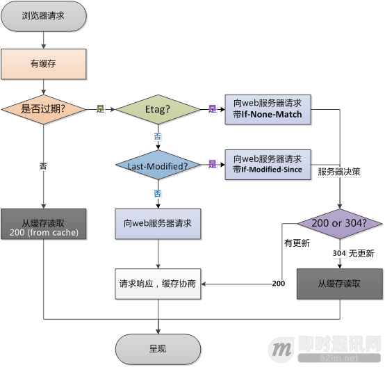
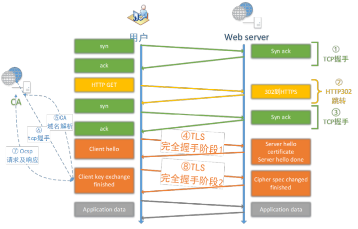
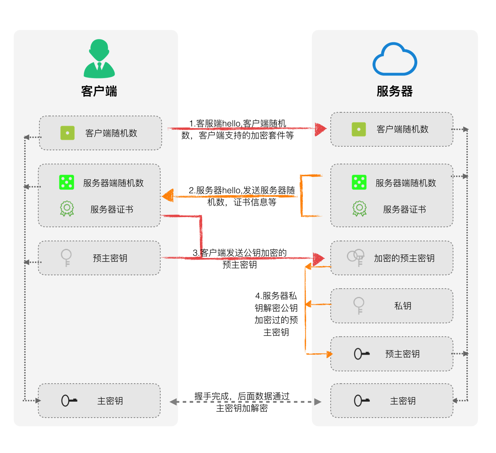

# interview - protocols 底层协议

## 底层协议
七层: 应用层、表示层、会话层(HTTP)、传输层(TCP, UDP)、网络层(IP)、数据链路层(Ethernet)、物理层

### [集线器、交换机、路由器功能原理入门](http://www.52im.net/thread-1629-1-1.html)
### [TCP (必看)](http://www.52im.net/thread-1107-1-1.html) 三次握手
以太网数据包（packet）的大小是固定的，最初是 1518 字节，后来增加到 1522 字节。其中， 1500 字节是负载（payload），22 字节是头信息（head）。IP 数据包在以太网数据包的负载里面，它也有自己的头信息，最少需要 20 字节; TCP 头信息也是 20 字节, 所以 TCP 数据包的负载实际为 1400 字节左右.

TCP 包有编号 SEQ, 例如发送方发送 seq=1, length=100bytes, 客户端返回 ACK=101, 发送方第二次返回 seq=101, length=xxx, 用以防止丢包; 如丢一个包, 客户端返回服务端的 ACK 序号不会增长, 发送方在收到 3 次连续重复 ACK 或 未收到 ACK 直至超时, 即确认丢包并重发.

应用层协议如 http 规定信息体大小 (`Content-Length`), 操作系统按端口接收并组装数据包转交给应用, 由应用根据信息体大小正确分段读取

TCP 协议有慢启动 (slow start) 机制, 根据丢包情况调整发送速率; Linux 内核设定初始一次性发包量 (发送窗口) 10. 即使对于带宽很大、线路很好的连接，初始也只发 10 包. 收到每两个包即发一个确认 (ACK: 下一个包的编号 + 本次 (接收窗口) 剩余包量)
### [UDP 和 TCP 区别](http://www.52im.net/thread-580-1-1.html), 或 [精华版](http://www.52im.net/thread-1277-1-1.html)

**简述**

TCP 是面向连接的、可靠的流协议。流就是指不间断的数据结构，当应用程序采用 TCP 发送消息时，虽然可以保证发送的顺序，但还是犹如没有任何间隔的数据流发送给接收端。TCP 为提供可靠性传输，实行 “顺序控制” 或 “重发控制” 机制。此外还具备 “流控制（流量控制）”、“拥塞控制”、提高网络利用率等众多功能。

UDP 是不具有可靠性的数据报协议。细微的处理它会交给上层的应用去完成。在 UDP 的情况下，虽然可以确保发送消息的大小，却不能保证消息一定会到达。因此，应用有时会根据自己的需要进行重发处理。

TCP 和 UDP 的优缺点无法简单地、绝对地去做比较：TCP 用于在传输层有必要实现可靠传输的情况；而在一方面，UDP 主要用于那些对高速传输和实时性有较高要求的通信或广播通信。TCP 和 UDP 应该根据应用的目的按需使用。

QQ 既有 UDP 又有 TCP

不管 UDP 还是 TCP，最终登陆成功之后，QQ 都会有一个 TCP 连接来保持在线状态。这个 TCP 连接的远程端口一般是 80，采用 UDP 方式登陆的时候，端口是 8000。

UDP 协议是无连接方式的协议，它的效率高，速度快，占资源少，但是其传输机制为不可靠传送，必须依靠辅助的算法来完成传输控制。QQ 采用的通信协议以 UDP 为主，辅以 TCP 协议。由于 QQ 的服务器设计容量是海量级的应用，一台服务器要同时容纳十几万的并发连接，因此服务器端只有采用 UDP 协议与客户端进行通讯才能保证这种超大规模的服务。

QQ 客户端之间的消息传送也采用了 UDP 模式，因为国内的网络环境非常复杂，而且很多用户采用的方式是通过代理服务器共享一条线路上网的方式，在这些复杂的情况下，客户端之间能彼此建立起来 TCP 连接的概率较小，严重影响传送信息的效率。而 UDP 包能够穿透大部分的代理服务器，因此 QQ 选择了 UDP 作为客户之间的主要通信协议。

采用 UDP 协议，通过服务器中转方式。因此，现在的 IP 侦探在你仅仅跟对方发送聊天消息的时候是无法获取到 IP 的。大家都知道，UDP 协议是不可靠协议，它只管发送，不管对方是否收到的，但它的传输很高效。但是，作为聊天软件，怎么可以采用这样的不可靠方式来传输消息呢？于是，腾讯采用了上层协议来保证可靠传输：如果客户端使用 UDP 协议发出消息后，服务器收到该包，需要使用 UDP 协议发回一个应答包。如此来保证消息可以无遗漏传输。之所以会发生在客户端明明看到 “消息发送失败” 但对方又收到了这个消息的情况，就是因为客户端发出的消息服务器已经收到并转发成功，但客户端由于网络原因没有收到服务器的应答包引起的。

很多人提到 keepalive，TCP 无法感知网络中断这些问题。。。这个算是 TCP 一个容易踩的坑，但这并不能说明 UDP 就比 TCP 好（或者说解释为何要使用 UDP）。因为在 UDP 上面一样需要面对这些问题，而解决这类问题的方法和在 TCP 上面进行应用层心跳的方法其实没有本质上的区别。而这就是为什么没有接触过这类问题的人会有题主提出的疑惑。

那么为什么呢？最本质上 UDP 的优势还是带宽的利用。这一切要回归到 99~03 年的网络状况，当时网络的特点就是接入带宽很窄而且抖动特别厉害。所谓抖动可能是多方面的，例如延时突发性地暴增、也有可能是由于路由层面的变化突然导致路由黑洞，还各种等等等等的问题。TCP 因为拥塞控制、保证有序等原因，在这种网络状态上对带宽的利用是非常低的。而且因为网络抖动的原因，应用层心跳超时（一般不依靠 keepalive）应用层主动断掉 socket 之后 TCP 需要三次握手才能重新建立链接，一旦出现频繁的小抖动就会使得带宽利用更低。而等待四次挥手的时间，也会占用服务器上宝贵的资源。

<b>总结来说，当网络差到一定程度了，TCP 的优势反而会成为劣势。</b>

这时候我们再看看 UDP 在这种情况下的表现。使用 UDP 对抗网络抖动，说到底就是在应用层比 TCP 更快地探测和重传，一旦超过一定的时间没有收到回复，客户端可以选择马上重试或者换一个 IP：PORT 重试（假如你的服务像 QQ 一样有多个接入），在服务器端则可以果断地断掉 socket。而可以应用 UDP 的时候，往往是你的应用层协议本身已经具备了一定的面向连接的特性。如果你应用层的协议已经达到了一定程度的消息幂等，客户端可以几乎无脑地进行重传，这样就可以尽可能地降低网络抖动的影响，同时也可以尽可能地利用整个带宽。而刚好 QQ 的协议，就具备类似的特点。

简单来说就是我们可以使用 UDP 实现一个面向连接协议，这个协议可以很好地适应当时的网络状况和 QQ 本身的业务。但凡事都有成本，成本就是你的应用层协议本身需要去实现抵抗网络异常带来的问题。例如乱序、例如业务数据的分片和重组、例如网络状态探测等等等等。。。

而现在 UDP 也应用在很多跨运营商、跨地域、跨机房之间的服务调用当中。原因无它，就是网络烂到一定程度

### TCP 握手
#### 建立连接 三次握手

1. `client syn`: 请求端（通常称为客户）发送一个 SYN 段指明客户打算连接的服务器的端口，以及初始序号（seq/ISN，在这个例子中为 1415531521）。这个 SYN 段为报文段 1。此时 客户端状态为 `syn_sent`
2. `server syn ack + server syn`: 服务器发回包含服务器的初始序号的 SYN 报文段（报文段 2）作为应答。同时，将确认序号设置为客户的 ISN/seq 加 1 以对客户的 SYN 报文段进行确认。一个 SYN 将占用一个序号。此时 服务端状态为 `syn_rcvd`
3. `client ack`: 客户必须将确认序号设置为服务器的 ISN 加 1 以对服务器的 SYN 报文段进行确认（报文段 3）。此时 客户端/服务端状态为 `established`

这三个报文段完成连接的建立。这个过程也称为三次握手（three-way handshake）。

#### 断开 四次握手
1. `client fin`: 客户端应用程序关闭, 发送 `FIN`
2. `server ack`: 收到, 序号+1, 向服务端应用提交 `EOF`, 开始关闭其连接, 向客户端发回 `ACK`
3. `server fin`: 服务端确认关闭, 发回 `FIN`
4. `client ack`: 客户端确认服务端的 `FIN`

### [HTTP](http://www.52im.net/thread-1677-1-1.html)

一个 http 请求

http 协商缓存
- 
- cookies 缓存

### HTTPS

如无优化或缓存, 最坏(访问 http 后跳转)比 http 增加 7 个 RTT (循环时间 Round-Trip Time)

[wireshark 抓包分析 RSA & DH 握手过程 (必看)](https://razeencheng.com/post/ssl-handshake-detail.html)
wireshark 抓包 TLS RSA 通信图示

[数字证书](http://www.enkichen.com/2016/02/26/digital-certificate-based/)

[SSL/TLS](https://segmentfault.com/a/1190000002554673)

TLS 握手步骤 (client-hello, server-hello, (cert verify with CA & OCSP), cipher-spec-exchanged)

1. `client-hello`: 客户端(浏览器)中完成地址输入后，解析域名获得 IP Host 地址，客户端会与此 Host 的 443 (默认，如果指定其他端口则会连接此端口) 尝试连接. 客户端会发送:
   1. `SSL version 协议版本`
   2. `supported ciphers 支持的加密`
   3. `supported compression 支持的压缩方法`
   4. `random`
2. `server-hello`: 服务器收到并存储 clientHello.random, 然后发给客户端
   1. `server cert 服务器证书`: 含 `public key`, 如果此证书无公钥, 还会发 `server key exchange`，
   2. `cipher suite 加密方法`: 服务器与客户端兼容的方法, 非对称加密/双钥加密 RSA/DSA/Diffie-Hellman/ECC 椭圆加密, 如版本不兼容则关闭该连接
   3. `random`
   4. `cert request` (optional): 如果是非常重要的信息, 服务端会向客户端发送 , 要求客户端提供证书(如银行 usb 密钥)
   5. `server-hello-done`
3. `client-key-exchange`: 如果服务端发送 `cert request`, 客户端需要发送自己的证书使其验证; 之后客户端验证服务器返回的证书
    - 有效期 (起止时间)
    - 域名 (与浏览器地址栏中域名是否匹配)
    - 吊销状态 (CRL+OCSP), [见 **吊销检查**].
    - 颁发机构，如果颁发机构是中间证书，在验证中间证书的有效期 / 颁发机构 / 吊销状态。一直验证到最后一层证书，如果最后一层证书是在操作系统或浏览器内置，那么就是可信的，否则就是自签名.
  
    以上验证步骤，需要全部通过。否则就会显示警告. 检查通过后, 生成 `master secret`. (PRF 为伪随机函数 pseudorandom function, PRF)

    `master_secret = PRF(pre_master_secret,"master secret",clientHello.random+serverHello.random)`

    之后发送给服务端如下内容
     1. `encrypted-random` ( `pre_master_secret`, 48byte, protocol_version+random[46] ): 用协商的 `cipher suite` + `server public key` 加密
     2. `change-cipher-spec`: 编码改变通知, 表明发送端已取得用以生成连接参数的足够信息，已生成加密密钥 (主密钥), 并且将切换到加密模式。客户端和服务器在条件成熟是会发送这个消息
     3. `encrypted-client-finish`: Encrypted Handshake Message, 由 `master-secret` 含之前所有握手信息依序以 `master secret` 计算的 hash (`verify_data` 字段), 以供验证

    服务器与浏览器交换的最终秘钥，session key 全等且未泄露 (1, 2 可以抓包，但 3 是无法窃听的, 1,2 和 3 的密文可以通过中间人攻击获得, 但无法获得证书颁发机构的私钥, 若在客户端和服务器中间搭建代理伪造证书, 会由客户端发现是非信任的证书颁发者而提出警告).
4. `server-change-cipher-spec`: 服务器解密 `premaster secret`, 用同样方式生成 `master secret`, 最后回应客户端:
   1. `change-cipher-spec`
   2. `encrypted-server-finished`: Encrypted Handshake Message
5. 如双方都能正确解密并验证, 通道建立.

#### 吊销检查
目前写进国际标准的吊销状态检查协议有两种: 1.CRL, 2. OCSP

CRL 是一份全量的文件，记录了被此 CRL 限制的证书中所有被吊销证书的序列号。通过匹配当前证书序列号，与 CRL 中序列号，来判断.

有点绕，反正就说，所有打上了这个 URL 的 CRL 的证书，只要其中一个被吊销，那么下次 CRL 更新时，均会查询匹配到.
那么可不可以认为一个中间颁发机构颁发的证书的 CRL 列表只有一个？不可以！因为数量可能太多，厂商完全可以将同一个中间证书颁发的最终证书，分不同批打不同的 CRL.
而 OCSP 是 TCP 服务，通过请求证书序列号，服务器告知当前序列号是否在被吊销名单.

有的证书内置了 CRL+OCSP, 有点只内置了 OCSP, 还有的早起证书只内置了 CRL, 但只内置 CRL 的证书是不被新型浏览器信任了.

签发者: 证书的签发者，通过以下步骤获得

1. 服务器证书，如果包含了证书链，浏览器会尝试匹配 (根据当前证书的 "签发者公钥" 匹配链中的后续证书的 "公钥"), 如果匹配失败，走 2.
2. 中如果有声明 签发者 URL, 浏览器尝试下载。并通过公钥匹配 (同 1), 如果匹配失败，走 3
3. 操作系统或客户端浏览器内置证书公钥匹配，如果匹配失败，则返回 ERR_CERT_AUTORITY_INVALID.
4. 附加项：如果任何一级证书，被声明了 oID, 则会被浏览器显示成 EV (绿色地址栏带上公司名称).

真正可能拖慢性能的，只可能是在吊销检查步骤中.

因为上面说了，吊销状态检查只能是同步的，那么受到 CA 厂商的部署限制，极可能会将 CRL 服务器和 OCSP 服务器部署在遥远的小机房，带宽 / 链路都是极差的，这种，DNS 解析和连接 CRL/OCSP 服务器均需要耗时.

问: 怎么规避吊销状态带来的损耗？

答案：仁者见仁，智者见智。这里给出两个建议

1. 踩上大厂的顺风车。如百度阿里腾讯和苹果微软操作系统各种常见网站和软体的服务器 / 代码签名证书，均有 CRL 和 OCSP, 而 CRL 是操作系统层复用的，只要在 TTL 时间内，操作系统检查过对应 CA 的 CRL, 那么 CRL 均可避免二次下载，用户访问就可实现加速. OCSP 也至少可以搭上一个免去 DNS 解析的红利。例如 Symantec/GeoTrust/GlobalSign
2. 买国内 CA 的证书。我指的是真正自己在浏览器根证书的 CA 啊，不包括仅仅是中间证书分销商，也不包括前面被除名然后变成分销商的 WoSign.

问: 12306 的证书部署，除了 CA 不受信任外，还有那些错误？

答：除了 CA 不受信任，还存在问题:

没有吊销状态声明，根据最新的 webtrust 标准，没有声明吊销状态的证书不受信任.
签名算法用了过期的 SHA-1.

劫持种类: 链路(绝大部分, 中间人攻击, man in the middle), DNS, 客户端

### HTTP2

- 压缩 http head, 减少数据包量
- 多路复用

### HTTP [状态码](https://juejin.im/post/5db7b2986fb9a02027084ff4)
分类 | 描述
 :- | :-
1** | 信息，服务器收到请求，需要请求者继续执行操作|
2** | 成功，操作被成功接收并处理
3** | 重定向，需要进一步的操作以完成请求
4** | 客户端错误，请求包含语法错误或无法完成请求
5** | 服务器错误，服务器在处理请求的过程中发生了错误

常用请求

200: 请求已成功，请求所希望的响应头或数据体将随此响应返回。

204: （OPTION / DELETE）服务器成功处理了请求，但不需要返回任何实体内容，并且希望返回更新了的元信息。响应可能通过实体头部的形式，返回新的或更新后的元信息。如果存在这些头部信息，则应当与所请求的变量相呼应。如果客户端是浏览器的话，那么用户浏览器应保留发送了该请求的页面，而不产生任何文档视图上的变化，即使按照规范新的或更新后的元信息应当被应用到用户浏览器活动视图中的文档。由于 204 响应被禁止包含任何消息体，因此它始终以消息头后的第一个空行结尾。

301: 被请求的资源已永久移动到新位置，并且将来任何对此资源的引用都应该使用本响应返回的若干个 URI 之一。

302: 请求的资源现在临时从不同的 URI 响应请求。由于这样的重定向是临时的，客户端应当继续向原有地址发送以后的请求。

304: 协商缓存；如果客户端发送了一个带条件的 GET请求且该请求已被允许，而文档的内容（自上次访问以来或者根据请求的条件）并没有改变，则服务器应当返回这个状态码。

400: 1、语义有误，当前请求无法被服务器理解。除非进行修改，否则客户端不应该重复提交这个请求。2、请求参数有误。

401: 当前请求需要用户验证。该响应必须包含一个适用于被请求资源的 WWW-Authenticate 信息头用以询问用户信息。客户端可以重复提交一个包含恰当的 Authorization 头信息的请求。如果当前请求已经包含了 Authorization 证书，那么 401响应代表着服务器验证已经拒绝了那些证书。如果 401响应包含了与前一个响应相同的身份验证询问，且浏览器已经至少尝试了一次验证，那么浏览器应当向用户展示响应中包含的实体信息，因为这个实体信息中可能包含了相关诊断信息。

403: 用户有授权但无权限；服务器已经理解请求，但是拒绝执行它。与 401响应不同的是，身份验证并不能提供任何帮助，而且这个请求也不应该被重复提交。

404: 请求失败，请求所希望得到的资源未被在服务器上发现。没有信息能够告诉用户这个状况到底是暂时的还是永久的。

500: 服务器遇到了一个未曾预料的状况，导致了它无法完成对请求的处理。一般来说，这个问题都会在服务器的程序码出错时出现。

502: 网关错误；作为网关或者代理工作的服务器尝试执行请求时，从上游服务器接收到无效的响应。

503: 网关过载；由于临时的服务器维护或者过载，服务器当前无法处理请求。这个状况是临时的，并且将在一段时间以后恢复。注意：503 状态码的存在并不意味着服务器在过载的时候必须使用它。某些服务器只不过是希望拒绝客户端的连接。

504: 网关超时；作为网关或者代理工作的服务器尝试执行请求时，未能及时从上游服务器（URI 标识出的服务器，例如 HTTP、FTP、LDAP）或者辅助服务器（例如 DNS）收到响应。

1** 请求

100: 客户端应当继续发送请求。这个临时响应是用来通知客户端它的部分请求已经被服务器接收，且仍未被拒绝。客户端应当继续发送请求的剩余部分，或者如果请求已经完成，忽略这个响应。服务器必须在请求完成后向客户端发送一个最终响应。

101: 服务器已经理解了客户端的请求，并将通过 Upgrade 消息头通知客户端采用不同的协议来完成这个请求。在发送完这个响应最后的空行后，服务器将会切换到在 Upgrade 消息头中定义的那些协议。只有在切换新的协议更有好处的时候才应该采取类似措施。例如，切换到新的 HTTP 版本比旧版本更有优势，或者切换到一个实时且同步的协议以传送利用此类特性的资源。

102: 由 WebDAV（RFC 2518）扩展的状态码，代表处理将被继续执行。

其他 2** 请求

201: 请求已经被实现，而且有一个新的资源已经依据请求的需要而建立，且其 URI 已经随 Location 头信息返回。假如需要的资源无法及时建立的话，应当返回 '202 Accepted'。

202: 服务器已接受请求，但尚未处理。正如它可能被拒绝一样，最终该请求可能会也可能不会被执行。在异步操作的场合下，没有比发送这个状态码更方便的做法了。返回 202状态码的响应的目的是允许服务器接受其他过程的请求（例如某个每天只执行一次的基于批处理的操作），而不必让客户端一直保持与服务器的连接直到批处理操作全部完成。在接受请求处理并返回 202状态码的响应应当在返回的实体中包含一些指示处理当前状态的信息，以及指向处理状态监视器或状态预测的指针，以便用户能够估计操作是否已经完成。

203: 服务器已成功处理了请求，但返回的实体头部元信息不是在原始服务器上有效的确定集合，而是来自本地或者第三方的拷贝。当前的信息可能是原始版本的子集或者超集。

205: 服务器成功处理了请求，且没有返回任何内容。但是与 204 响应不同，返回此状态码的响应要求请求者重置文档视图。该响应主要是被用于接受用户输入后，立即重置表单，以便用户能够轻松地开始另一次输入。

206: 服务器已经成功处理了部分 GET 请求。类似于 FlashGet 或者迅雷这类的 HTTP 下载工具都是使用此类响应实现断点续传或者将一个大文档分解为多个下载段同时下载。该请求必须包含 Range 头信息来指示客户端希望得到的内容范围，并且可能包含 If-Range 来作为请求条件。响应必须包含如下的头部域:Content-Range 用以指示本次响应中返回的内容的范围；如果是 Content-Type 为 multipart/byteranges 的多段下载，则每一 multipart 段中都应包含 Content-Range 域用以指示本段的内容范围。假如响应中包含 Content-Length，那么它的数值必须匹配它返回的内容范围的真实字节数。Date ETag 和/或Content-Location，假如同样的请求本应该返回 200响应。Expires, Cache-Control，和/或 Vary，假如其值可能与之前相同变量的其他响应对应的值不同的话。假如本响应请求使用了 If-Range 强缓存验证，那么本次响应不应该包含其他实体头；假如本响应的请求使用了 If-Range 弱缓存验证，那么本次响应禁止包含其他实体头；这避免了缓存的实体内容和更新了的实体头信息之间的不一致。否则，本响应就应当包含所有本应该返回 200响应中应当返回的所有实体头部域。假如 ETag 或 Last-Modified 头部不能精确匹配的话，则客户端缓存应禁止将 206响应返回的内容与之前任何缓存过的内容组合在一起。任何不支持 Range 以及 Content-Range 头的缓存都禁止缓存 206响应返回的内容。

207: 由 WebDAV(RFC 2518) 扩展的状态码，代表之后的消息体将是一个 XML 消息，并且可能依照之前子请求数量的不同，包含一系列独立的响应代码。

其他 3** 请求

300: 被请求的资源有一系列可供选择的回馈信息，每个都有自己特定的地址和浏览器驱动的商议信息。用户或浏览器能够自行选择一个首选的地址进行重定向。

303: 对应当前请求的响应可以在另一个 URI 上被找到，而且客户端应当采用 GET 的方式访问那个资源。这个方法的存在主要是为了允许由脚本激活的 POST 请求输出重定向到一个新的资源。这个新的 URI 不是原始资源的替代引用。同时，303响应禁止被缓存。

305: 被请求的资源必须通过指定的代理才能被访问。Location 域中将给出指定的代理所在的 URI 信息，接收者需要重复发送一个单独的请求，通过这个代理才能访问相应资源。只有原始服务器才能建立 305 响应。

307: 请求的资源现在临时从不同的 URI 响应请求。由于这样的重定向是临时的，客户端应当继续向原有地址发送以后的请求。

其他 4** 请求

402: 该状态码是为了将来可能的需求而预留的。目前为 payment required.

405: 请求行中指定的请求方法不能被用于请求相应的资源。该响应必须返回一个 Allow 头信息用以表示出当前资源能够接受的请求方法的列表。

406: 请求的资源的内容特性无法满足请求头中的条件，因而无法生成响应实体。

407: 与 401响应类似，只不过客户端必须在代理服务器上进行身份验证。

408: 请求超时。客户端没有在服务器预备等待的时间内完成一个请求的发送。客户端可以随时再次提交这一请求而无需进行任何更改。

409: 由于和被请求的资源的当前状态之间存在冲突，请求无法完成。

410: 被请求的资源在服务器上已经不再可用，而且没有任何已知的转发地址。

411: 服务器拒绝在没有定义 Content-Length 头的情况下接受请求。在添加了表明请求消息体长度的有效 Content-Length 头之后，客户端可以再次提交该请求。

412: 服务器在验证在请求的头字段中给出先决条件时，没能满足其中的一个或多个。

413: 服务器拒绝处理当前请求，因为该请求提交的实体数据大小超过了服务器愿意或者能够处理的范围。

414: 请求的 URI 长度超过了服务器能够解释的长度，因此服务器拒绝对该请求提供服务。

415: 对于当前请求的方法和所请求的资源，请求中提交的实体并不是服务器中所支持的格式，因此请求被拒绝。

416: 如果请求中包含了 Range 请求头，并且 Range 中指定的任何数据范围都与当前资源的可用范围不重合，同时请求中又没有定义 If-Range 请求头，那么服务器就应当返回 416状态码。

417: 在请求头 Expect 中指定的预期内容无法被服务器满足，或者这个服务器是一个代理服务器，它有明显的证据证明在当前路由的下一个节点上，Expect 的内容无法被满足。

421: 从当前客户端所在的 IP 地址到服务器的连接数超过了服务器许可的最大范围。

423: 请求格式正确，但是由于含有语义错误，无法响应。

424: 由于之前的某个请求发生的错误，导致当前请求失败，例如 PROPPATCH。

425: 在 WebDav Advanced Collections 草案中定义，但是未出现在《WebDAV 顺序集协议》（RFC 3658）中。

426: 客户端应当切换到 TLS/1.0。

449: 由微软扩展，代表请求应当在执行完适当的操作后进行重试。

其他 5** 请求

501: 服务器不支持当前请求所需要的某个功能。当服务器无法识别请求的方法，并且无法支持其对任何资源的请求。

505: 服务器不支持，或者拒绝支持在请求中使用的 HTTP 版本。这暗示着服务器不能或不愿使用与客户端相同的版本。响应中应当包含一个描述了为何版本不被支持以及服务器支持哪些协议的实体。

506: 由《透明内容协商协议》（RFC 2295）扩展，代表服务器存在内部配置错误：被请求的协商变元资源被配置为在透明内容协商中使用自己，因此在一个协商处理中不是一个合适的重点。

507: 服务器无法存储完成请求所必须的内容。这个状况被认为是临时的。WebDAV (RFC 4918)

509: 服务器达到带宽限制。这不是一个官方的状态码，但是仍被广泛使用。

510: 获取资源所需要的策略并没有没满足。（RFC 2774）

## Q & A

[TCP 连接和 HTTP 请求](https://zhuanlan.zhihu.com/p/93586950)
* 现代浏览器在与服务器建立了一个 TCP 连接后是否会在一个 HTTP 请求完成后断开？什么情况下会断开？
  
  默认情况下建立 TCP 连接不会断开，只有在请求报头中声明 Connection: close 才会在请求完成后关闭连接。因此一个 TCP 连接可以对应多个 HTTP 请求
* 一个 TCP 连接中 HTTP 请求发送可以一起发送么（比如一起发三个请求，再三个响应一起接收）？
  
  在 HTTP/1.1 存在 Pipelining 技术可以完成这个多个请求同时发送，但是由于浏览器默认关闭，所以可以认为这是不可行的。在 HTTP2 中由于 Multiplexing 特点的存在，多个 HTTP 请求可以在同一个 TCP 连接中并行进行。
* 为什么有的时候刷新页面不需要重新建立 SSL 连接？

  在第一个问题的讨论中已经有答案了，TCP 连接有的时候会被浏览器和服务端维持一段时间。TCP 不需要重新建立，SSL 自然也会用之前的。
* (非 http2 )浏览器对同一 Host 建立 TCP 连接到数量有没有限制？
  
  当浏览器拿到一个有几十张图片的网页该怎么办呢？肯定不能只开一个 TCP 连接顺序下载，那样用户肯定等的很难受，但是如果每个图片都开一个 TCP 连接发 HTTP 请求，那电脑或者服务器都可能受不了，要是有 1000 张图片的话总不能开 1000 个 TCP 连接吧，你的电脑同意 NAT 也不一定会同意。
  
  有。Chrome 最多允许对同一个 Host 建立六个 TCP 连接。不同的浏览器有一些区别。
* 收到的 HTML 如果包含几十个图片标签，这些图片是以什么方式、什么顺序、建立了多少连接、使用什么协议被下载下来的呢？
  
  如果图片都是 HTTPS 连接并且在同一个域名下，那么浏览器在 SSL 握手之后会和服务器商量能不能用 HTTP2，如果能的话就使用 Multiplexing 功能在这个连接上进行多路传输。不过也未必会所有挂在这个域名的资源都会使用一个 TCP 连接去获取，但是可以确定的是 Multiplexing 很可能会被用到。
  
  如果发现用不了 HTTP2 呢？或者用不了 HTTPS（现实中的 HTTP2 都是在 HTTPS 上实现的，所以也就是只能使用 HTTP/1.1）。那浏览器就会在一个 HOST 上建立多个 TCP 连接，连接数量的最大限制取决于浏览器设置，这些连接会在空闲的时候被浏览器用来发送新的请求，如果所有的连接都正在发送请求呢？那其他的请求就只能等等了。

**关于 HTTP 协议，下面错误的是哪个一个：**

A. 看到网页有乱码，则很有可能是某个请求的 Content-Type 响应头丢失或者是值设置不当造成的 
B. 即便是不需要发送请求体的 GET 请求，请求头区域下方也必须留一个空行（CRLF） 
C. 服务端可以根据客户端发送的 Accept-Encoding  请求头来分别返回不同压缩格式（Gzip、Brotli）的文件 
**D. 服务端返回的 Date 响应头表示服务器上的系统时间，除给人读外没有实际用途 **
E. HTTP 是无状态的，网站是通过 Cookie 请求头来识别出两个请求是不是来自同一个浏览器的 
F. Access-Control-Allow-Origin 响应头只支持配置单个的域名或者是 * ，不支持配置多个特定的域名

D 为错误选项，Date 响应头有参与缓存时长的计算，不仅仅是给人看看服务器时间。

带有 target="_blank" 的 a 标签被认为是有安全风险的，因为点击它后打开的新标签页面可以通过 window.opener.location = 来将来源页面跳转到钓鱼页面，不过给该 a 标签增加下面哪些属性就能阻止这一行为？

A. rel="nofollow"  
**B. rel="noopener"**  
**C. rel="noreferrer"**  
D. rel="opener" 
E. rel="external"  
F. rel="parent"

