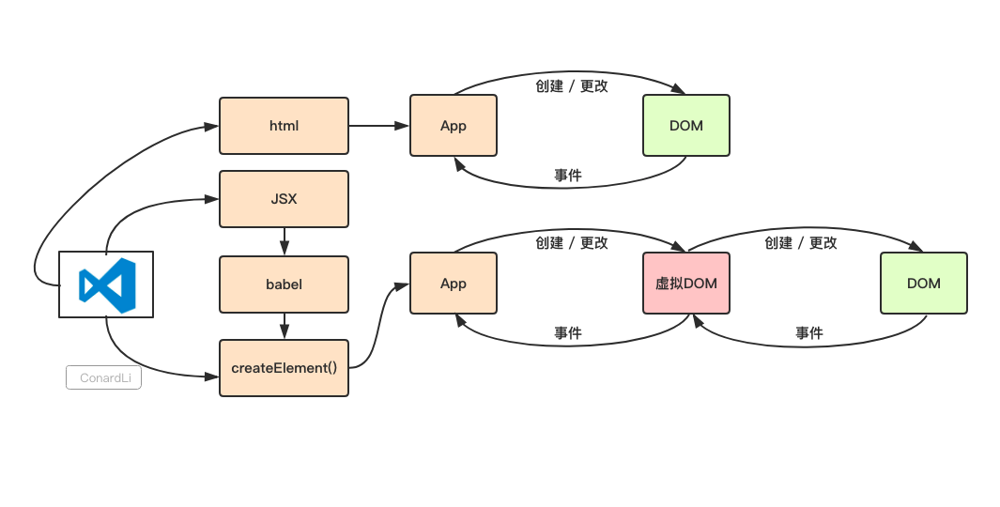
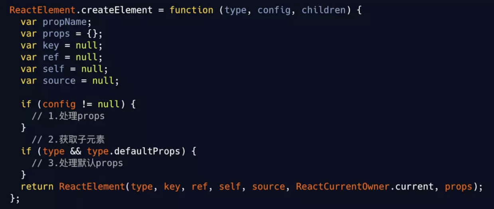

# interview - React

## Concept 基本原理
react.js is a library for UI view layer via manipulating virtual dom; react-dom and react-native are the implementation for the platforms.

### Virtual DOM
通过类似 html tag 的 `JSX`, 使用 babel 创建 `vdom`, 根据虚拟dom 渲染 dom tree, 每次更新 diff vdom, 然后重新渲染.

[参考](https://juejin.im/post/5cb66fdaf265da0384128445)



KEY babel transform
```json
{
  "plugins": [
    ["transform-react-jsx", {
      "pragma": "React.createElement"
    }]
  ]
}
```

`createElement()`



### LifeCycle / Hooks Management

### `setState()`
async, batch, trigger `update` & `rerender` (if `shouldComponentUpdate` is not optimized)

在实际开发中，setState 的表现有时会不同于理想情况:
- 在 mount 流程中调用 setState。
- 在 setTimeout/Promise 回调中调用 setState。
在第一种情况下，不会进入 update 流程，队列在 mount 时合并修改并 render。

在第二种情况下，setState 将不会进行队列的批更新，而是直接触发一次 update 流程。

这是由于 setState 的两种更新机制导致的，只有在批量更新模式中，才会是 “异步” 的。

### Diff VDOM
开销最大, 可做优化最多, 三条基本策略:
- WebUI 中 DOM 节点跨节点的操作特别少，可以忽略不计。
- 拥有相同类的组件会拥有相似的 DOM 结构。拥有不同类的组件会生成不同的 DOM 结构。
- 同一层级的子节点，可以根据唯一的 ID 来区分。
具体方法:
- 对树进行分层比较，只对比两棵树同级别的节点。跨层级移动节点，将会导致节点删除，重新插入，无法复用。
- 对组件进行类比较，类相同的递归 diff 子节点，不同的直接销毁重建。diff 对同一层级的子节点进行处理时，会根据 key 进行简要的复用。两棵树中存在相同 key 的节点时，只会移动节点。
- 对比同一层级子节点时, 以新树的第一个子节点作为起点遍历新树，寻找旧树中与之相同的节点。存在则移动位置, 不存在则新建一个子节点.

#### Diff 优化
减少 update 次数, 减少非理想状况 `setState()`

### React patch, Event System

### Reconciliation & Render

### Fiber

### Performance

## Q & A
> refer to https://juejin.im/post/5dc20a4ff265da4d4e30040b

Key points:

`<ErrorBoundary>`:

`hooks`: 允许在不编写类的情况下使用 state 和其他 React 特性, 减少层级嵌套或重写。使用 Hooks，可以从组件中提取有状态逻辑，这样就可以独立地测试和重用它。Hooks 允许在不改变组件层次结构的情况下重用有状态逻辑，这样在许多组件之间或与社区共享 Hooks 变得很容易。

`<StrictMode>`: 验证内部组件是否遵循某些推荐做法，如果没有，会在控制台给出警告。

验证是否使用的已经废弃的方法，如果有，会在控制台给出警告。

通过识别潜在的风险预防一些副作用。

`prop drilling`: prop 层层传递, 可以用 `React.Context` 或 `状态管理库` 代替

`Fiber`: 新的`协调引擎`或重新实现核心算法。它的主要目标是支持`虚拟 DOM 的增量渲染` (能够将渲染工作分割成块，并将其分散到多个帧中)。React Fiber 的目标是提高其在动画、布局、手势、暂停、中止或重用等方面的适用性，并为不同类型的更新分配优先级，以及新的并发原语。
